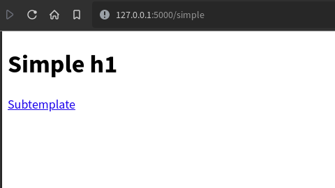

# Flask Templates

### Author: Denis Rinfret

## Template Inheritance

- Jinja2 supports *template inheritance*
    - create a base template that contains the common blocks of your web site,
      such as
        - the *HTML DOCTYPE* and the `<head>` element
        - the web page banner
        - the navigation bar
        - the footer
        - etc...
    - create one template for each page that extends the base template
    - add the page specific contents to the subtemplates
- To facilitate adding page specific contents to each subtemplate, define *
  blocks* in the base template
- Subtemplates can redefine these blocks
    - use `` to define the start of a block named *head* (
      replace *head* by whatever is appropriate)
    - use `` to mark the end of a block

### Simple Template Inheritance Example

- Parent template
    - project `02_flask_templates`, file `simple.html`

~~~~html
<!DOCTYPE html>
<html lang="en">
<head>
    <meta charset="UTF-8">
    <title>Simple Template Inheritance Example</title>
    
</head>
<body>

<h1>Simple h1</h1>


<a href="sub">Subtemplate</a>

</body>
</html>
~~~~



- Child template
    - file `sub.html`

~~~~html


Subtemplate


{{ super() }}
<h3>Subtemplate h3</h3>



<a href="simple">Simple</a>

~~~~

- A new title is defined in the `title` block
- An `h3` is added to the `contents` block
    - `super()` is called to keep the parent template's contents
- The `foot` block is replaced by a new link
- The `head` block is not modified directly (only the `title` sub-block is
  modified)


### Bootstrap Template Example

#### File `base.html`

- This template uses Bootstrap 4
- Almost the same as aprevious example (`bs4_base.html`), but with Jinja2 blocks
  added


~~~~html
<!DOCTYPE html>
<html lang="en">
<head>
    
    <title>SOEN287 Web Programming</title>
    <meta charset="utf-8">
    <meta name="viewport" content="width=device-width, initial-scale=1">
    <link rel="stylesheet"
          href="https://maxcdn.bootstrapcdn.com/bootstrap/4.3.1/css/bootstrap.min.css">
    <script src="https://ajax.googleapis.com/ajax/libs/jquery/3.4.1/jquery.min.js"></script>
    <script src="https://cdnjs.cloudflare.com/ajax/libs/popper.js/1.14.7/umd/popper.min.js"></script>
    <script src="https://maxcdn.bootstrapcdn.com/bootstrap/4.3.1/js/bootstrap.min.js"></script>
    <style>body {
        padding-top: 50px
    }</style>
    
</head>
<body>


<nav class="navbar navbar-expand-md bg-dark navbar-dark fixed-top">
    <a class="navbar-brand" href="/">SOEN287</a>
    <button class="navbar-toggler" type="button" data-toggle="collapse"
            data-target="#collapsibleNavbar">
        <span class="navbar-toggler-icon"></span>
    </button>
    <div class="collapse navbar-collapse" id="collapsibleNavbar">
        <ul class="navbar-nav">
            <li class="nav-item">
                <a class="nav-link" href="/slides">Slides</a>
            </li>
            <li class="nav-item">
                <a class="nav-link" href="/documents">Course Documents</a>
            </li>
            <li class="nav-item">
                <a class="nav-link" href="/assignments">Assignments</a>
            </li>
            <li class="nav-item">
                <a class="nav-link" href="/contact">Contact</a>
            </li>
        </ul>
    </div>
</nav>

<br>


<div class="container">
    <h1>Welcome to the <em>SOEN287 Web Programming</em> course web site!</h1>
    <p>This is a course taught at <a href="https://concordia.ca">Concordia
        University</a> in Montreal, Canada.</p>
    <p>Follow the links in the navigation bar for more details.</p>
    <p>Please note that the source code for this web site, written in Python
        using the Flask framework, is used
        as examples in the course. That's why some pages are not really
        necessary or contain multiple formats for
        the same data, such as the <a href="/slides">Slides</a> page.</p>
</div>


</body>
</html>


~~~~

#### File `assignments.html`

- Template rendered by the `/assignments` endpoint
    - extends the base template
    - calls `super()` in the `title` block and adds a string to it
    - the content block is completely redefined here
    - the other blocks are left as-is


~~~~html


{{ super() }} - Assignments


<div class="container">
    <h1>Assignments</h1>
    <p>Assignments will be posted on the <a href="https://moodle.concordia.ca">Moodle
        course page</a>.</p>
</div>
 <!-- content -->
~~~~

#### File `contact.html`

- Template rendered by the `/contact` endpoint
    - extends the base template
    - it simply lists contact information in a `<dl>`


~~~~html


{{ super() }} - Contact


<div class="container">
    <h1>Contact</h1>
    <dl class="row">
        <dt class="col-sm-3">Professor</dt>
        <dd class="col-sm-9">Denis Rinfret</dd>

        <dt class="col-sm-3">Email</dt>
        <dd class="col-sm-9"><a href="mailto:denis.rinfret@concordia.ca">mailto:denis.rinfret@concordia.ca</a>
        </dd>

        <dt class="col-sm-3">Office</dt>
        <dd class="col-sm-9">EV3.217</dd>

        <dt class="col-sm-3">Office Hours</dt>
        <dd class="col-sm-9">To be announced (probably Wednesday and/or Friday
            morning)
        </dd>
    </dl>
</div>
 <!-- content -->
~~~~

#### File `slides.html`

- Template rendered by the `/slides` endpoint
    - extends the base template
    - this example shows 2 ways to list a number of files using a `for` loop
    - normally, only 1 of the 2 would be used in a page


~~~~html


{{ super() }} - Slides


<div class="container">
    <h1>Slides</h1>
    <h3>Plain HTML list</h3>
    <ol>
        
        <li><a href="{{ slide[1] }}">{{ slide[0] }}</a></li>
        

    </ol>
    <h3>Bootstrap List Group</h3>
    <div class="list-group">
        
        <a href="{{ slide[1] }}" class="list-group-item list-group-item-action">{{
            slide[0] }}</a>
        
    </div>
</div>
 <!-- content -->
~~~~

#### Generating a Plain HTML List

- `slide_list` is a Python list containing tuples of the form *(text, href)*,
  where
    - *text* is the link text to be displayed, and
    - *href* is the URL
- So we loop over all the tuples in the list with a `for` loop
- And we build an `<a>` element using
    - `{{ slide[1] }}` to get the value of `href`, and
    - `{{ slide[0] }}` to get the text

#### Generating a Bootstrap List Group

- We use the same `for` loop as before, except that the loop is located inside
  a `<div class="list-group">`
- The `<a>` element is generated in the same way, except that we need to add a
  couple Bootstrap classes to display each link correctly
    - `class="list-group-item list-group-item-action">`

#### The `/slides` Endpoint

- For now, we build a list of tuples for each slides manually in the endpoint
- In the documents endpoint, the list will be built with data read from a CSV
  file
- How to read data from a database will be covered later on

```python
@app.route('/slides')
def slides():
    prefix = '/static/'
    slide_list = [('Course Outline', prefix + '00_outline.slides.html'),
                  ('HTML', prefix + '01_html.slides.html')]
    return render_template('slides.html', slide_list=slide_list)

```

##### Notes

- The `.slides.html` files are not templates, they are HTML versions of the
  slides used in class
- These files are *static* files, not executed or processed by Flask in anyway
- Static files are usually put inside the `static/` folder
- Flask has a special `/static/<file_to_be_returned_as_is>` endpoint to handle
  these
- In a live deployment, the web server (not Flask) will serve the static files
  to get better performance

#### File `documents.html`

- Template rendered by the `/documents` endpoint
    - extends the base template
    - it builds a table from a Python list passed to the template
    - data read from a CSV file is used to build the list
    - the contents of this CSV file is given next
    - the first column is the *id*, the second is the *topic*, followed by 3
      file names, one for each format:
        - HTML slides (`.slides.html`)
        - HTML (1 page, `.html`)
        - Jupyter Notebook (`.ipynb`)
- the endpoint code and CSV files are shown after the screenshot but before the
  template


#### File: `slides.csv`

`id,title,slides,html,notebook
0,Course Outline,00_outline.slides.html,00_outline.html,00_outline.ipynb
1,HTML,01_html.slides.html,01_html.html,01_html.ipynb
2,CSS,02_css.slides.html,02_css.html,02_css.ipynb
3,Python,03_python.slides.html,03_python.html,03_python.ipynb
4,Flask,04_flask.slides.html,04_flask.html,04_flask.ipynb
5,JavaScript,05_js.slides.html,05_js.html,05_js.ipynb`

#### The `/documents` Endpoint

```python
@app.route('/documents')
def documents():
    # TODO: put the prefix in the app config dictionary
    prefix = '/static/'
    with open('data/slides.csv') as f:
        doc_list = list(csv.reader(f))[1:]
    return render_template('documents.html',
                           doc_list=doc_list,
                           prefix=prefix)
```

#### File `documents.html`

~~~~html


{{ super() }} - Course Documents


<div class="container">
    <h1>Course Documents</h1>
    <table class="table table-dark table-striped table-hover table-responsive-md">
        <thead>
        <tr>
            <th></th>
            <th>Topic</th>
            <th>Slides</th>
            <th>HTML (1 page)</th>
            <th>Jupyter Notebook</th>
        </tr>
        </thead>
        <tbody>
        
        <tr>
            
            <td>{{ col }}</td>
            
            
            <td><a href="{{ prefix }}{{ col }}">{{ col }}</a></td>
            
        </tr>
        
        </tbody>
    </table>
</div>
 <!-- content -->
~~~~

## Sending Data to the Web Server Using HTML Forms

### Example: Contact Form

- Project: `03_flask_forms`, file `01_contact_form.html`

<!DOCTYPE html>
<html lang="en">
<head>
    <meta charset="UTF-8">
    <title>Contact Form</title>
</head>
<body>
    <h1>Contact Form</h1>
    <!-- The action is usually an endpoint on the server to handle the submitted data -->
    <form action="/contact_form" method="post">
        <label>Your name <input type="text" name="name"/></label><br/>
        <label>Your email address <input type="email" name="email"/></label><br/>
        <label>Your message <textarea name="message"></textarea></label><br/>
        <button type="submit">Send</button>
        <button type="reset">Clear</button>
    </form>
</body>
</html>

~~~~html
<!DOCTYPE html>
<html lang="en">
<head>
    <meta charset="UTF-8">
    <title>Contact Form</title>
</head>
<body>
<h1>Contact Form</h1>
<!-- The action is usually an endpoint on the server to handle the submitted data -->
<form action="/contact_form" method="post">
    <label>Your name <input type="text" name="name"/></label><br/>
    <label>Your email address <input type="email" name="email"/></label><br/>
    <label>Your message <textarea name="message"></textarea></label><br/>
    <button type="submit">Send</button>
    <button type="reset">Clear</button>
</form>
</body>
</html>
~~~~

#### The `form` element

- The 2 most important attributes to the `form` element are the `action`
  and `method` attributes
- The `action` specifies where the form data will be sent
    - in this case, it will send the data to the `/contact_form` endpoint
- The `method` specifies how to send the data
    - in this case, it will send the data using the *POST* method
    - the default method is *GET*, which should **not** normally be used by
      forms in most cases
    - the `/contact_form` endpoint should be configured to handle POST requests
    - by default, endpoints will only accept GET requests

#### Labels and Inputs

- It is common to label the input elements with a `label` element containing the
  input element
- An `input` of type `text` is a simple text box, containing only 1 line of
  input text
- An `input` of type `email` is a specialised version of the simple text box: it
  differs only in the way the data will be validated
- A `textarea` is a generalisation of the simple text box: it supports multiple
  rows of input text
- In order for the data input to be sent to the server, the `name` attributes
  have to be set to names unique within the form (some exceptions to this rule
  will be covered later on)
    - without a `name` attribute, the input data will not be sent
- The last 2 form elements are buttons
    - the first button will `submit` the form data to the `action` specified in
      the `form` element
    - the second button will clear, or `reset` the form data
    - the text shown on the buttons will be, respectively, *Send* and *Clear*

#### `/` and `/contact_form` endpoints

```python
@app.route('/')
def contact_form():
    return render_template('01_contact_form.html')


@app.route('/contact_form', methods=['POST'])
def handle_contact_form():
    # we should normally validate the submitted form data before 
    # using it
    # by default, the template rendering will be considered unsafe,
    # so the data will be escaped
    return render_template('03_contact_response.html',
                           data=request.form)
```

- The `/` endpoint simply renders the template containing the form, which is
  just the HTML file shown above
- The `/contact_form` endpoint will handle the POST request coming from the form
  submission
- The `methods=['POST']` argument to the `route` function specifies that this
  endpoint will only handle POST requests
    - GET requests will not be accepted
- The only thing we do, for now, is to render the `03_contact_response.html`
  template with the form data that was submitted
    - to access the submitted form data, simply use `request.form`
    - request must be imported from the `flask` package
    - `request.form` is a special kind of object holding the form data, and its
      properties correspond to the `name` attributes specified in the form

#### File: `03_contact_response.html`

~~~~html
<!DOCTYPE html>
<html lang="en">
<head>
    <meta charset="UTF-8">
    <title>Message Received</title>
</head>
<body>
<h1>Thank you <em>{{ data.name }}</em> for your message!</h1>
<p>We will contact you shortly.</p>
<p>Email: {{ data.email }}</p>
<p>Message: {{ data.message }}</p>
</body>
</html>
~~~~


#### Do Not Trust the Data Sent to the Server!

- By default, Flask and Jinja2 do not trust the data sent to the server
- This is the safe and smart way to deal with form data
- Before inserting the form data in the template, it will *escape* the data
    - the message `Hello <h1>SOEN</h1>287!` is not safe, it can mess up the
      template if not escaped properly
      

- Escaping the string `Hello <h1>SOEN</h1>287!` will give the
  string `Hello &lt;h1&gt;SOEN&lt;/h1&gt;287!`
- In this way, the form data will not mess up the HTML in the template
- Instead of a simple `h1` element, someone could try to inject some JavaScript
  code and try to take advantage of the client and/or server
- If the data to be inserted in the template can be trusted, then we can use
  the `safe` template decorator in this way:
    - `<p>Message: {{ data.message|safe }}</p>`
    - in this case, `data.message` will not be escaped, and we will get the
      result shown in the previous screenshot

#### `/contact_form2` endpoint

- Usually, we should not only echo the form data back to the client, we should
  process the data in some way
- For our example, we could save the form data in a file or in a database,
  and/or send some email to the web site owner
- Since interacting with a database and sending emails have not been covered
  yet, we will, for now, save the form data in a CSV file
- Modify the `/` endpoint to render the `02_contact_form.html` template
    - it contains a slightly different version of the contact form
    - the form data will be sent to the `/contact_form2` endpoint

#### `/contact_form2` Endpoint

```python
@app.route('/contact_form2', methods=['POST'])
def handle_contact_form2():
    with open('data/messages.csv', 'a') as f:
        writer = csv.writer(f)
        writer.writerow([request.form['name'],
                         request.form['email'],
                         request.form['message']])
    return render_template('03_contact_response.html',
                           data=request.form)
```

#### File `messages.csv`

```Denis,Denis@example.com,Hello SOEN287!
Alice,Alice@example.com,Alice and Bob
Alice,Alice@example.com,"Alice and Bob
Bob and Alice"```


#### Contact Form, File `02_contact_form`

~~~~html
<!DOCTYPE html>
<html lang="en">
<head>
    <meta charset="UTF-8">
    <title>Contact Form</title>
</head>
<body>
<h1>Contact Form</h1>
<!-- The action is usually an endpoint on the server to handle the submitted data -->
<form action="/contact_form2" method="post">
    <table>
        <tr>
            <td><label>Your name</label></td>
            <td><input type="text" name="name"/></td>
        </tr>
        <tr>
            <td><label>Your email address </label></td>
            <td><input type="email" name="email"/></td>
        </tr>
        <tr>
            <td><label>Your message </label></td>
            <td><textarea name="message" rows="10" cols="40"></textarea></td>
        </tr>
        <tr>
            <td></td>
            <td>
                <button type="submit">Send</button>
                <button type="reset">Clear</button>
            </td>
        </tr>
    </table>


</form>
</body>
</html>
~~~~

### GET vs. POST Requests
- W3Schools *HTTP Methods* https://www.w3schools.com/tags/ref_httpmethods.asp
- The two most common HTTP methods are: GET and POST.
#### What is HTTP?
- The Hypertext Transfer Protocol (HTTP) is designed to enable communications between clients and servers.
- HTTP works as a request-response protocol between a client and server.
- A web browser may be the client, and an application on a computer that hosts a web site may be the server.
- Example: 
    - A client (browser) submits an HTTP request to the server
    - then the server returns a response to the client
    - the response contains status information about the request and may also contain the requested content.
    


#### HTTP Methods
- GET
- POST
- PUT
- HEAD
- DELETE
- PATCH
- OPTIONS


#### The GET Method
- GET is used to request data from a specified resource.
- GET is one of the most common HTTP methods.
- Note that the query string (name/value pairs) is sent in the URL of a GET request:
    - `test/demo_form.php?name1=value1&name2=value2`
- Some other notes on GET requests:
    - GET requests can be cached
    - GET requests remain in the browser history
    - GET requests can be bookmarked
    - GET requests should never be used when dealing with sensitive data
    - GET requests have length restrictions
    - GET requests is only used to request data (not modify)
    


#### The POST Method
- POST is used to send data to a server to create/update a resource.
- The data sent to the server with POST is stored in the request body of the HTTP request:

`POST /test/demo_form.php HTTP/1.1
Host: w3schools.com
name1=value1&name2=value2`
- POST is one of the most common HTTP methods.
- Some other notes on POST requests:
    - POST requests are never cached
    - POST requests do not remain in the browser history
    - POST requests cannot be bookmarked
    - POST requests have no restrictions on data length
    


#### GET vs. POST
<table class="w3-table-all notranslate">
  <tbody><tr>
    <th style="width:30%">&nbsp;</th>
    <th style="width:35%">GET</th>
    <th>POST</th>
  </tr>
  <tr>
    <td>BACK button/Reload</td>
    <td>Harmless</td>
    <td>Data will be re-submitted (the browser should alert the user that the data are about to be re-submitted)</td>
  </tr>
  <tr>
    <td>Bookmarked</td>
    <td>Can be bookmarked</td>
    <td>Cannot be bookmarked</td>
  </tr>
  <tr>
    <td>Cached</td>
    <td>Can be cached</td>
    <td>Not cached</td>
  </tr>
  <tr>
    <td>Encoding type</td>
    <td>application/x-www-form-urlencoded</td>
    <td>application/x-www-form-urlencoded or multipart/form-data. Use multipart encoding for binary data</td>
  </tr>
  <tr>
    <td>History</td>
    <td>Parameters remain in browser history</td>
    <td>Parameters are not saved in browser history</td>
  </tr>
  </tbody></table>
  
  

#### GET vs. POST
<table class="w3-table-all notranslate">
  <tbody><tr>
    <th style="width:30%">&nbsp;</th>
    <th style="width:35%">GET</th>
    <th>POST</th>
  </tr>
  <tr>
    <td>Restrictions on data length</td>
    <td>Yes, when sending data, the GET method adds the data to the URL; and the length of a URL is limited (maximum URL length is 2048 characters)</td>
    <td>No restrictions</td>
  </tr>
  <tr>
    <td>Restrictions on data type</td>
    <td>Only ASCII characters allowed</td>
    <td>No restrictions. Binary data is also allowed</td>
  </tr>
  <tr>
    <td>Security</td>
    <td>GET is less secure compared to POST because data sent is part of the URL<br>
 <br>
 Never use GET when sending passwords or other sensitive information!</td>
    <td>POST is a little safer than GET because the parameters are not stored in browser history or in web server logs</td>
  </tr>
  <tr>
    <td>Visibility</td>
    <td>Data is visible to everyone in the URL</td>
    <td>Data is not displayed in the URL</td>
  </tr>
  </tbody></table>
  


#### Reloading a Page With POSTed Data
- When reloading a page having POSTed data associated to it, depending on which browser you use,
    - it will ask you to confirm if you want to resubmit the data to the server
        - if yes, it will resubmit the data
    - or it will resubmit the data without asking for your confirmation
- In both cases, you may end up with duplicated data on the server, depending on how the form submission is handled
- When no precautions are implemented (like in the previous examples), you will end up with duplicated data
- When forms are handled correctly (like in the following examples), no duplicated data will end up on the server (at least not because of form resubmission through a reload)

### Proper Form Submission and Handling 
#### With `wtforms` and `flask_wtf`
- *WTForms* are used to simplify and standardize HTML forms creation and handling
- `flask_wtf` is a Flask wrapper around `wtforms`
- The first step is to define a subclass of `FlaskForm`
    - in our example we define a `ContactForm` class
- We need to import these classes in order to be able to define our contact form


```python
from flask_wtf import FlaskForm
from wtforms import StringField, TextAreaField
from wtforms.fields.html5 import EmailField
from wtforms.validators import InputRequired, Email
```

#### `ContactForm` Class, File `02_app.py`

```python
class ContactForm(FlaskForm):
    name = StringField('Name', validators=[InputRequired()])
    email = EmailField('Email', validators=[InputRequired(), Email()])
    message = TextAreaField('Message', validators=[InputRequired()])
```

- `name`, `email` and `message` are *class variables* (similar to *static
  fields* in Java)
- They are initialized to `Field` objects of the correct types
    - the first argument to each field constructor is the field name
    - the second is a list of *validators*
        - in our form, all the fields are *required*, meaning they cannot be
          empty (`InputRequired` validator)
        - additionally, our email field must be a valid email address (`Email`
          validator)
        - note the use of parentheses `()` after the validators

#### Some Other Available Fields

https://wtforms.readthedocs.io/en/stable/fields.html

- `BooleanField`
- `DateField`
- `DecimalField`
- `IntegerField`
- `RadioField`
- `SelectField`
- `EmailField`

#### Some Other Built-In Validators

https://wtforms.readthedocs.io/en/stable/validators.html

- `EqualTo`: useful to compare 2 form fields for equality
- `Length`: validate a string's length
- `NumberRange`: check if a number is within a given range
- `RegExp`: check if the field matches a given regular expression
- `AnyOf`: check if the field value is in a list of values (*white-listing*)
- `NoneOf`: check if the field value is *not* in a list of values (*
  black-listing*)

#### Rendering the Form and Handling the Form Data

- The best solution is to have a single endpoint for both
    - if the request method was GET, or if the submitted data doesn't validate,
      then render the form
    - if the request method was POST, and the submitted data validates, then
      process the form data

```python
@app.route('/contact_form4', methods=['GET', 'POST'])
def handle_contact_form4():
    form = ContactForm()
    if form.validate_on_submit():
        with open('data/messages.csv', 'a') as f:
            writer = csv.writer(f)
            writer.writerow([form.name.data, form.email.data,
                             form.message.data])
        return redirect(url_for('contact_response',
                                name=form.name.data))
    return render_template('04_contact_form.html', form=form)
```

1. create a form by instantiating the `ContactForm` class
    - this will automatically use the form data available in `request.form`
2. `form.validate_on_submit()` will first check if there was data submitted, and
   if the submitted data is valid
3. if it is valid, then process the form data as before,
    - except that the data is taken from `form`, not `request.form`
    - and that on success, we redirect to a response page
        - this way, reloading the response page will not resubmit the data since
          it will not have any form data associated to it
4. if we don't have valid submitted data, then render the form template

- The first time a user gets to this endpoint should be through a GET request
    - no data was submitted (the submit method is always POST), so the contact
      form in variable `form` will have empty data
    - `form.validate_on_submit()` will be false, so the form template will be
      rendered with empty form data
- If there was data submitted (through the POST method)
    - the `form` object will contain that data
    - if the data doesn't validate, then the form template will be rendered with
      the submitted form data, to avoid requiring the user to fill the form
      again
    - if the form data validates, then it will be processed as described earlier

#### File `04_contact_form.html`

##### `<form>` element

~~~~html
<!DOCTYPE html>
<html lang="en">
<head>
    <meta charset="UTF-8">
    <title>Contact Form</title>
</head>
<body>
<h1>Contact Form</h1>

<ul class="errors">
    
    
    <li>{{ form[field_name].label }}: {{ error }}</li>
    
    
</ul>

<!-- The action is usually an endpoint on the server to handle the submitted data -->
<form action="/contact_form4" method="post">
    {{ form.csrf_token }}
    <table>
        <tr>
            <td>{{ form.name.label }}</td>
            <td>{{ form.name }}</td>
        </tr>
        <tr>
            <td>{{ form.email.label }}</td>
            <td>{{ form.email }}</td>
        </tr>
        <tr>
            <td>{{ form.message.label }}</td>
            <td>{{ form.message }}</td>
        </tr>
        <tr>
            <td></td>
            <td>
                <button type="submit">Send</button>
                <button type="reset">Clear</button>
            </td>
        </tr>
    </table>


</form>
</body>
</html>
~~~~

- The layout of this form is similar to the previous example, it is using
  a `table` to align the fields.
- To get a field's label, we need to use, for example for the email
  field, `form.email.label`
- For the field itself, we need to use `form.email`
    - this will be translated
      to `<input id="email" name="email" required="" type="email" value="">`
    - in this example, we created the email field with
      `email = EmailField('Email', validators=[InputRequired(), Email()])`
    - `'Email'` is actually the label for this field, and the `id` and
      the `name` attributes will be equal to the class variable name used when
      defining the `ContactForm` (in this case, the class variable name
      is `email`)
    - if we want a different id, we could create the field in this way
      `email = EmailField('Your email address', id='someotherid', validators=[InputRequired(), Email()])`
- the `form.csrf_token` is for security purpose, to help prevent *Cross-Site
  Request Forgery* attacks
    - in the Python file, we also need to set the `app.secret_key`
        - to make more secure, we should something better than `'allo'`
    - more on this later on

#### Error Reporting

- Some error reporting is done automatically through some kind of tooltips or
  pop-ups
    - this type of error reporting is handled by the browser, so the way it's
      done may vary
- The browsers don't catch everything, they only catch the validation rules that
  can be specified in HTML
- The other validation errors are caught when we create the `ContactForm` object
  and call `form.validate_on_submit()`
    - the errors are associated with the fields inside the form object
    - the contact form template needs to check if there are any errors and
      include them in the HTML if necessary
    - the easiest way to do it is with an if statement and 2 for loops before
      the form element
    - another way to do it will be shown later on

~~~~html

<ul class="errors">
    
    
    <li>{{ form[field_name].label }}: {{ error }}</li>
    
    
</ul>

~~~~

### Post/Redirect/Get Pattern

#### From Book: Flask Web Development 2e, Miguel Grinberg

- When the last request sent is a POST request with form data, a refresh would
  cause a duplicate form submission, which in almost all cases is not the
  desired action.
- For that reason, the browser asks for confirmation from the user.
- Many users do not understand this warning from the browser.
- *Consequently, it is considered good practice for web applications to never
  leave a POST request as the last request sent by the browser.*
- This is achieved by responding to POST requests with a redirect instead of a
  normal response.
- A redirect is a special type of response that contains a URL instead of a
  string with HTML code.
- When the browser receives a redirect response, it issues a GET request for the
  redirect URL, and that is the page that it displays.
- Now the last request is a GET, so the refresh command works as expected.
- **This trick is known as the Post/Redirect/Get pattern.**

- In our example, the line

  `return redirect(url_for('contact_response', name=form.name.data))`

  will redirect to the contact response using the GET method
- That endpoint doesn't have access to the form data, so we pass the name to it
  to have a personalized message
- Don't pass `form.name` to the redirect because it will pass the whole input
  field to the redirect
- `form.name.data` will pass only the value of that field
- The contact response endpoint simply takes the name given as argument and
  renders a template

```python
@app.route('/contact_response/<name>')
def contact_response(name):
    return render_template('05_contact_response.html', name=name)
```

- The template is also quite simple

~~~~html
<!DOCTYPE html>
<html lang="en">
<head>
    <meta charset="UTF-8">
    <title>Message Received</title>
</head>
<body>
<h1>Thank you <em>{{ name }}</em> for your message!</h1>
<p>We will contact you shortly.</p>
</body>
</html>
~~~~

### Bootstrap Forms

#### Files `03_app.py` and `forms.py`

- Since in this section we will have more forms and longer forms, it is more
  appropriate to create a separate file, `forms.py`, and put all the form
  definitions there
- In `03_app.py`, we need to import these forms with

  `from forms import ContactForm, ExamplesForm`
- Starting from the Bootstrap templates created earlier, we will start by adding
  the contact form to the contact page
- Then more form fields will be introduced in 2 different formats:
    - plain HTML
    - wtforms + Bootstrap

#### ContactForm

- The Python code for the contact form is almost identical compared to the
  previous section
    - the endpoints code has been slightly modified to change the routes and the
      template files names to render
    - The `ContactForm` class has been moved to `forms.py` with 2 small changes
        - to change the number of rows in the message text area, an extra
          argument as been given to the field: `render_kw={'rows': 10}`
        - a submit field has been added directly in the form

```python
class ContactForm(FlaskForm):
    name = StringField('Name', validators=[InputRequired()])
    email = EmailField('Email', validators=[InputRequired(), Email()])
    message = TextAreaField('Message', validators=[InputRequired()],
                            render_kw={'rows': 10})
    submit = SubmitField('Send')
```


#### `/contact` and `/contact_response` endpoints

```python
@app.route('/contact', methods=['GET', 'POST'])
def contact():
    form = ContactForm()
    if form.validate_on_submit():
        with open('data/messages.csv', 'a') as f:
            writer = csv.writer(f)
            writer.writerow([form.name.data, form.email.data,
                             form.message.data])
        return redirect(url_for('contact_response',
                                name=form.name.data))
    return render_template('contact.html', form=form)


@app.route('/contact_response/<name>')
def contact_response(name):
    return render_template('contact_response.html', name=name)
```

#### `contact.html`

- The contact template is quite simple because it is calling a *macro* (similar
  to a function) defined in the base template
- It is calling the `quick_form` macro taking the form object as an argument
  along with the action attribute for the form

~~~~html


{{ super() }} - Contact


<div class="container">
    {# This div container is the same as before #}
    <h1>Contact</h1>
    <dl class="row">
        <dt class="col-sm-3">Professor</dt>
        <dd class="col-sm-9">Denis Rinfret</dd>

        <dt class="col-sm-3">Email</dt>
        <dd class="col-sm-9"><a href="mailto:denis.rinfret@concordia.ca">mailto:denis.rinfret@concordia.ca</a>
        </dd>

        <dt class="col-sm-3">Office</dt>
        <dd class="col-sm-9">EV3.217</dd>

        <dt class="col-sm-3">Office Hours</dt>
        <dd class="col-sm-9">To be announced (probably Wednesday and/or Friday
            morning)
        </dd>
    </dl>
</div>

<div class="container">
    <h1>Contact Form</h1>
    {{ quick_form(form, '/contact') }}
</div>
 <!-- content -->
~~~~

#### `base.html` macros

- There are actually 2 macros in the base template
    - `quick_form`, called by the contact template to quickly render a form
    - `form_group`, called by the other macro, to render 1 form field
- `quick_form` basically loops on all the form fields, and calls `form_group` on
  each field (with some exceptions)

~~~~html

<form action="{{ action }}" class="form" method="POST">
    
    
    {{ field() }}
    
    {{ field(class_="btn btn-primary") }}
    
    {{ form_group(field) }}
    
    
</form>

~~~~

- `HiddenField`, `CSRFTokenField` and `SubmitField` are special fields
    - they don't need any label
    - they won't have any error messages associated to them
    - so render them directly

#### `form_group` macro

- This macro renders a form field
- Depending on the field type, it will be rendered differently
- It starts by putting the field in a *form-group row*
- And then renders the field label with the proper Bootstrap classes
- The following step depends on the field type:
    - if it's a checkbox group (`MultiCheckboxField`) or a radio button
      group (`RadioField`), it will loop over all the choices to include them in
      proper `div` elements with proper Bootstrap classes
        - if there are errors, it will use the `is-invalid` class
        - if not, it will use the `col-sm-6` class
        - it will render all the choices in a single row (
          class `form-check-inline`)

~~~~html

<div class="form-group row required">
    {{ field.label(class_="col-sm-2 col-form-label") }}
    
    
    <div class="form-control is-invalid">
        
        <div class="form-control col-sm-6">
            
            
            <div class="form-check form-check-inline">
                {{ choice(class_="form-check-input") }}
                {{ choice.label(class_="form-check-label") }}
            </div>
            
        </div>
        ~~~~

        - if the field is not a group, it will also check if there are errors or
        not, and use either the `is-invalid` or the `col-sm-6` classes
        - if there are errors, if will render what the errors are (and not just
        change the style to invalid)

        ~~~~html
        
        
        {{ field(class_="form-control is-invalid") }}
        
        {{ field(class_="form-control col-sm-6") }}
        
        
        
        
        <div class="invalid-feedback">
            {{ error }}
        </div>
        
        
    </div>
    
~~~~

### More Form Field Examples

- The `examples1` endpoint shows how to use a few more different kinds of form
  fields
- It simply renders a template containing a form with many different field types
- A more complete example with a `FlaskForm` will follow

```python
@app.route('/examples1')
def examples():
    return render_template('examples1.html')
```


#### File `example1.html`

~~~~html


{{ super() }} - Examples 1


<div class="container">
    <h1>Examples 1</h1>
    <h3>Forms</h3>
    <form id="form01" action="/form_data1" method="post">
        <label>Username <input type="text" name="username"/></label><br/>
        <label>Password <input type="password" name="pwd"></label><br/>
        <label>Age <input type="number" name="age" min="1"
                          max="125"/></label><br/>
        <label>Favorite color <input type="color"
                                     name="fav_color"/></label><br/>
        <label>Date of birth <input type="date" name="dob"/></label><br/>
        <label>Checkbox group
            <label><input type="checkbox" name="checkbox_group" value="c1"/>Checkbox
                1</label>
            <label><input type="checkbox" name="checkbox_group" value="c2"/>Checkbox
                2</label>
            <label><input type="checkbox" name="checkbox_group" value="c3"/>Checkbox
                3</label>
        </label><br/>
        <label>Radio button group
            <label><input type="radio" name="radio_group" value="r1"/>Radio
                button 1</label>
            <label><input type="radio" name="radio_group" value="r2"/>Radio
                button 2</label>
            <label><input type="radio" name="radio_group" value="r3"/>Radio
                button 3</label>
        </label><br/>
        <label>Drop down select <select name="select1">
            <option value="o1">Option 1</option>
            <option value="o2">Option 2</option>
            <option value="o3">Option 3</option>
        </select></label><br/>
        <input type="submit" name="Input Submit"/>
        <button type="submit">Button Submit</button>
        <input type="reset" name="Input Reset"/>
        <button type="reset">Button Reset</button>
    </form>
</div>
 <!-- content -->
~~~~

- The form's action is `/form_data1`, which renders a template that simply loops
  through all the form fields and displays them in a `dl` element

```python
@app.route('/form_data1', methods=['POST'])
def form_data1():
    return render_template('form_data1.html', form=request.form,
                           checkboxes=request.form.getlist('checkbox_group'))
```

#### File `form_data1.html`

~~~~html


{{ super() }} - Form Data


<div class="container">
    <h1>Form Data</h1>
    <dl>
        
        <dt>{{ key }}</dt>
        <dd>{{ form[key] }}</dd>
        
    </dl>
    {{ checkboxes }}
</div>
 <!-- content -->
~~~~

#### Checkboxes

- There only one tricky part in this example: handling checkboxes
- Checkboxes are different from other fields since there might be many
  checkboxes checked at any given time
- We need to get all the checked checkboxes from a checkbox group
  with `request.form.getlist('checkbox_group')`
- In this example, this list of checked checkboxes is passed separately to the
  template, which inserts it directly in the page with `{{ checkboxes }}`
- We could also loop on `checkboxes` to get a fancier output

#### `/examples2` endpoint

- This example is similar to the previous one, except that
    - it defines a subclass of `FlaskForm` to facilitate form validation and
      handling
    - it uses Bootstrap classes for rendering
- For simplicity, it is reusing the `form_data1.html` template from the previous
  example to display form data if the form is valid

```python
@app.route('/examples2', methods=['GET', 'POST'])
def examples2():
    form = ExamplesForm()
    if form.validate_on_submit():
        return render_template('form_data1.html', form=request.form,
                               checkboxes=request.form.getlist(
                                   'checkbox_group'))
    return render_template('examples2.html', form=form)
```


#### `ExamplesForm`

```python
class ExamplesForm(FlaskForm):
    username = StringField('Username',
                           validators=[InputRequired(), Length(4, 64),
                                       Regexp('^[A-Za-z][A-Za-z0-9_.]*$', 0,
                                              'Usernames must start with a letter and must have only letters, numbers, dots or underscores')])
    password = PasswordField('Password',
                             validators=[InputRequired(), Length(8)])
    age = IntegerField('Age',
                       validators=[InputRequired(), NumberRange(1, 125)])
    fav_color = ColorField('Favorite Color',
                           validators=[InputRequired()])
    dob = DateField('Date of birth', validators=[InputRequired()])
```

#### New validators

- `Length(4, 64)` and `Length(8)`: the string length must be between 4 and 64
  characters (inclusive), and the length must be at least 8 characters long
- `NumberRange(1, 125)`: a number must be between 1 and 125 (inclusive)
- `Regexp('^[A-Za-z][A-Za-z0-9_.]*$', 0, 'Error Message')`: the string must
  match the given regular expression to be valid (refer to the section on
  regular expressions)
    - in this case, usernames must start with a letter and must have only
      letters, numbers, dots or underscores

```python
    checkbox_group = MultiCheckboxField('Checkbox group',
                                        validators=[InputRequired()],
                                        choices=[('c1', 'Checkbox 1'),
                                                 ('c2', 'Checkbox 2'),
                                                 ('c3', 'Checkbox 3')],
                                        render_kw={'required': True})
radio_group = RadioField('Radio button group',
                         validators=[InputRequired()],
                         choices=[('r1', 'Radio button 1'),
                                  ('r2', 'Radio button 2'),
                                  ('r3', 'Radio button 3')],
                         render_kw={'required': True})
select = SelectField('Drop down select',
                     validators=[InputRequired()],
                     choices=[('o1', 'Option 1'), ('o2', 'Option 2'),
                              ('o3', 'Option 3')])
submit = SubmitField('Submit')
```

- The field type `MultiCheckboxField` is actually not a standard field type
    - it is defined as a subclass of `SelectMultipleField` to provide checkboxes
      as default widgets
    - often, checkboxes are not used in a checkgroup, they are added in forms
      separately from other fields
        - in this case use a `BooleanField`
    - but if you need a checkbox group, you can do it this way
- One problem with checkbox and radio button groups is that the `InputRequired`
  validator doesn't seem to have any effect in many Flask versions (probably a
  bug)
    - this is why the parameter `render_kw={'required': True}` has been added to
      force it to be required
- `choices` is a list of (obviously) choices
    - each choice is a tuple with 2 strings: its value followed by its label

```python
class MultiCheckboxField(SelectMultipleField):
    widget = ListWidget(prefix_label=False)
    option_widget = CheckboxInput()
```

- The last part of this `ExamplesForm` is a custom validator
- Built-in validators cannot cover all possible cases
- A custom validator is a function with a name starting with `validate_`
- The remainder of the function name must correspond to a field name (in this
  case `password`)
- It will automatically be called if the name is set correctly, no need to add
  it to `validators`

```python
    def validate_password(self, field):


    with open('data/common_passwords.txt') as f:
        for line in f.readlines():
            if field.data == line.strip():
                raise ValidationError(
                    'Your password is too common.')
```

- This custom validator checks if a password is too common
- If yes, it will raise a `ValidationError` and the field will be marked as
  invalid
- We assume here that the file `data/common_passwords.txt` contains 1 password
  per line, and that it contains the passwords we want to avoid
- In our simplified example, the password file contains only 3 passwords

```python
12345678
11111111
password
```

#### `examples2.html`

- This template is quite simple since we are using the same `quick_form` macro
  to render the form
- This is not perfect, the layout of some fields is not optimal, but that's why
  it's qualified as *quick*
    - we could improve the macro to get a better layout
    - or we could skip the macro and fine tune the layout directly in
      the `examples2.html` template

~~~~html


{{ super() }} - Examples 1


<div class="container">
    <h1>Examples</h1>
    <h3>Forms</h3>
    {{ quick_form(form, '/examples2') }}
</div>


~~~~

## Flask Sessions

- Sessions are used to remember some data between user requests
- By design, the *Hypertext Transfer Protocol (HTTP)*, and the *Internet
  Protocol (IP)* on which HTTP is built are **stateless**
    - the server doesn't normally retain data about the client
- When a session is created, a special *token* will be saved as a *cookie* on
  the client side (normally in a web browser)
- The server will associate data to this token and keep it in local storage (
  server-side)
- When the client makes another request to the server, the session token will be
  checked by the server to match it with associated data
- Without sessions, it would be harder to maintain secure sessions between the
  client and the server
    - users surely don't want to re-enter their password on every request

### First Session Example

- The first session example is quite simple
    - it is a variation on the *Hello SOEN287!* example
- The `/` endpoint is displaying, by default, the simple *Hello SOEN287!* page
- But if there's a name saved in the session, say for example *Alice*, then it
  will display the page *Hello Alice!* instead
- To be able to set the name inside the session, use the dynamic
  endpoint `/<name>`
    - it will take the given name and save it in the session, then redirect
      to `/`

```python
from flask import Flask, session, redirect

app = Flask(__name__)
app.secret_key = 'allo'


@app.route('/')
def hello_world():
    return 'Hello {}!'.format(session.get('name', 'SOEN287'))


@app.route('/<name>')
def set_name(name):
    session['name'] = name
    return redirect('/')


if __name__ == '__main__':
    app.run()
```

- The `session` object is like a dictionary
    - we can use the square bracket notation `[]` to access or set values
      associated to some keys
    - `session['name'] = name` sets the value associated to the `'name'` key
    - we could simply use `session['name']` in the `/` endpoint to get the value
      associated to the name key
        - but if the name key doesn't exists, it will throw a `KeyError`
    - instead, we call the `get` function on the session, and provide a default
      value
        - `session.get('name', 'SOEN287')` will get the value associated to
          the `name` key
        - and if there's nothing associated to it, it will return the default
          value `'SOEN287'`

### Login Form V1

#### File `02_app.py`

- The first version of a login form to open an authenticated session has 3
  endpoints:
    - `/`: display a welcome message, with either a login or logout link
    - `/login`: GET and POST methods accepted
        - GET: display a login form
        - POST: if the submitted form data validates, then start a session for
          the user and redirect to `/`
    - `/logout`: clear the session data and redirect to `/`

#### `LoginForm`

- *Note*: to keep the example simple, some validators have been omitted

```python
class LoginForm(FlaskForm):
    username = StringField('username', validators=[DataRequired()])
    password = PasswordField('password', validators=[DataRequired()])
    submit = SubmitField('login')
```

#### `/login` endpoint

- If the submitted form data is valid, we simply, for now, set the `username`
  key in the `session` object
- When the user is redirected to `/`, or when a subsequent request is made, it
  will be possible to get the `username` from the `session` object
- If there is no username in the session, then we assume the user is not logged
  in
    - this is not the best way to handle logins, it is only the first step to
      get to a better way

```python
@app.route('/login', methods=['GET', 'POST'])
def login():
    form = LoginForm()
    if form.validate_on_submit():
        # should check if username/password pair is valid
        # for now, just accept everything
        session['username'] = form.username.data
        return redirect('/')
    return render_template('login.html', form=form)
```

#### `/logout` Enpoint

- The only thing we need to do here is to call the `clear` function on
  the `session` object to clear (remove) all key-value pairs in the session
- Then we redirect to `/`

```python
@app.route('/logout')
def logout():
    session.clear()
    return redirect('/')
```

#### `/` Endpoint

- This endpoint simply renders the `index1.html` template, with the `username`
  variable set to `session.get('username')`
- In this case, we didn't provide a default value to `get`, so we will
  get `None` if the username is not set in the session
    - this will, again, help us avoid a `KeyError` if the provided key is not in
      the session
    - `None` will evaluate to `False` when it is used in an `if` statement, such
      as
        - `if username` in a Python file
        - `` in a template

```python
@app.route('/')
def index():
    return render_template('index1.html',
                           username=session.get('username'))
```

#### File `index1.html`

- This template checks if there is a `username` or not
    - if the `username` is `None`, then it will evaluate to `False`
        - so we will jump to the `else` block
        - and a default welcome message with a link to the *login* page will be
          displayed
    - if the `username` is **not** `None`, then we have a username to work with
        - so we welcome the user by a personalized welcome message
        - then we provide a *logout* link

~~~~html
<!DOCTYPE html>
<html lang="en">
<head>
    <meta charset="UTF-8">
    <title>Session Examples</title>
</head>
<body>

<h1>Welcome {{ username }}!</h1>
<a href="/logout">Logout</a>

<h1>Welcome Stranger!</h1>
<a href="/login">Login</a>

</body>
</html>
~~~~

### Login Form V2

#### File `03_app.py`

- The only change in this version compared to the previous one is how we handle
  the form data
- Instead of accepting any username/password pair, we have a passwords file
  containing the registered users' password
- In the `/login` endpoint, if the submitted form data validates, we call
  the `check_password` function with the provided username/password pair
    - if we have a match, then we set the username in the session as before
    - if not, we *flash* an error message
        - *flash*ed messages will be automatically available in the templates (
          refer to the `login.html` template below)
        - *flash*ed messages will be displayed just before the login form

#### `/login` Endpoint

```python
@app.route('/login', methods=['GET', 'POST'])
def login():
    form = LoginForm()
    if form.validate_on_submit():
        if check_password(form.username.data, form.password.data):
            session['username'] = form.username.data
            return redirect('/')
        else:
            flash('Incorrect username/password!')
    return render_template('login.html', form=form)
```

#### `check_password` Function

```python
# not a safe way to store and verify passwords, but it will do for now  
def check_password(username, password):
    with open('data/passwords.csv') as f:
        for user in csv.reader(f):
            if username == user[0] and password == user[1]:
                return True
    return False
```

#### File `passwords.csv`

```python
denis, 1234
rob, allo
```

- To verify passwords, we open a CSV file for reading
- The first element of each row is a username
- The second element is the corresponding password
- If both the submitted username and password match the current record in the
  CSV file, then return `True`
- If not, then keep searching
- If we reach the end of the file without a match, then return `False`

#### File `login.html`

- The only new thing in this template is the loop through flashed messages
- We do a for loop on all the messages returned by the call to the built-in
  function `get_flashed_messages`
- And we simply display all of them separated by a break `<br/>`

~~~~html
<!DOCTYPE html>
<html lang="en">
<head>
    <meta charset="UTF-8">
    <title>Session Examples</title>
</head>
<body>

{{ message }}<br/>

<form action="/login" method="post">
    {{ form.csrf_token }}
    {{ form.username.label }} {{ form.username }}<br/>
    {{ form.password.label }} {{ form.password }}<br/>
    {{ form.submit }}
</form>
</body>
</html>
~~~~

### Better Login System: `flask_login` Package

- File `04_app.py`
- As it is the case for most common tasks required to run a web site, there
  exists a package to help out managing logins and sessions
- `flask_login` helps managing logins, users and permissions, without being too
  restrictive

#### Step 1: `LoginManager`

- We need to start a `LoginManager`, which we import from `flask_login`, in this
  way:

  `login_manager = LoginManager()`

  `login_manager.init_app(app)`

#### Step 2: `User` class

- We also need to define a `User` class to represent our users
    - the easiest way is to subclass `UserMixin` (imported from `flask_login`)
    - for now, we only need a username, and since we must define an `id` for
      each user with this package, we set `self.id` to be the username in the
      constructor

```python
class User(UserMixin):
    def __init__(self, username):
        self.id = username
```

#### Step 3: `load_user`

- We need to define a `load_user` function to retrieve user details from a user
  id
- For now, a user is defined only by its username, so we create a `User` object
  with the username provided
    - in a more complete application, the user information will be more
      detailed (name, email address, profile photo, ...)
    - this user information will normally be read from a file or from a database
- The decorator `@login_manager.user_loader` is needed in order to let the login
  manager know which function to call to load a user

```python
@login_manager.user_loader
def load_user(user_id):
    return User(user_id)
```

#### Step 4: `/login` endpoint

- The `/login` endpoint is very similar to the previous example, except that we
  need to call the `login_user` function, imported from `flask_login`, to let
  the login manager know that the user has logged in successfully
- The only other difference, besides the additional flashed message, is how the
  user is redirected to another page after a successful log in
    - when a user tries to access a protected page without being logged in, the
      user will be redirected to the login page
    - then after a successfull login, it is often more convenient to redirect
      the user to whatever page she was trying to access before being redirected
    - the page to be redirected to will be stored in the session, with the
      key `next`
    - so we get the `next` page from the session instead of always redirecting
      to `/`

```python
@app.route('/login', methods=['GET', 'POST'])
def login():
    form = LoginForm()
    if form.validate_on_submit():
        if check_password(form.username.data, form.password.data):
            login_user(User(form.username.data))
            flash('Logged in successfully.')

            # check if the next page is set in the session by the @login_required decorator
            # if not set, it will default to '/'
            next_page = session.get('next', '/')
            # reset the next page to default '/'
            session['next'] = '/'
            return redirect(next_page)
        else:
            flash('Incorrect username/password!')
    return render_template('login.html', form=form)
```

#### Step 5: protect endpoints with `@login_required`

- `@login_required` is a decorator imported from `flask_login`
- If we want an endpoint to be accessible only to logged in users, then we *
  decorate* the endpoint with `@login_required`

```python
@app.route('/protected')
@login_required
def protected():
    return render_template('protected.html')
```

- If the user requesting the protected endpoint is not logged in, he will be
  automatically redirected to the `/login` endpoint
- If already logged in, then it will just go through and execute the endpoint
  function as normal
- In order for these redirects to work correctly, we need the following 2
  lines (just after setting up the login manager)

  `login_manager.login_view = 'login'`

  `app.config['USE_SESSION_FOR_NEXT'] = True`

- Without setting the `login_view`, attempting to access `@login_required`
  endpoints will result in an error

- It is more convenient to use sessions to store the `next` parameter, so that's
  why `'USE_SESSION_FOR_NEXT'` is set to `True` in the app configuration
  dictionary

#### File `protected.html`

- Showing only the contents of the `<body>` element

~~~~html
<!DOCTYPE html>
<html lang="en">
<head>
    <meta charset="UTF-8">
    <title>Session Examples</title>
</head>
<body>

{{ message }}<br/>


<h1>You have to be authenticated to view this</h1>
<h3>current_user.id: {{ current_user.id }}</h3>
<h3>current_user.is_authenticated: {{ current_user.is_authenticated }}</h3>
</body>
</html>
~~~~

- After displaying the flashed messages, this page is showing how to refer to
  the current user
    - simply access the `current_user` object
    - and access the fields you need, such as `current_user.id`
- use `current_user.is_authenticated` to determine if the current user is
  authenticated of not
    - by default, `flask_login` uses a special anonymous user when no user is
      logged in
        - its `is_authenticated` field will always be false
    - when is a user is actually logged in, `is_authenticated` will be true
- The file `non_protected.html` is almost identical

#### Step 6: `/logout` endpoint

- When logging out, instead of clearing the session directly, it is better to
  call the `logout_user` function (also imported from `flask_login`), to let the
  login manager handle it
- Note that this endpoint is also decorated with `@login_required`, since it
  does not make sense to logout if the user is not currently logged in

```python
@app.route('/logout')
@login_required
def logout():
    logout_user()
    return redirect('/')
```

#### File `index2.html`

- This template uses `current_user.is_authenticated` to display different things
  to logged in users and anonymous users
- Note that this template is used by both this example and the next, so that's
  why it is checking if the current user has an email and a phone number
    - in this example, a user doesn't have these fields
    - but in the next, a user will have these fields
- Showing only the contents of the `<body>` element and skipping the display of
  flashed messages

~~~~html
<!DOCTYPE html>
<html lang="en">
<head>
    <meta charset="UTF-8">
    <title>Session Examples</title>
</head>
<body>

{{ message }}<br/>


<h1>Welcome {{ current_user.id }}!</h1>

<dl>
    <dt>email</dt>
    <dd>{{ current_user.email }}</dd>
    <dt>phone</dt>
    <dd>{{ current_user.phone }}</dd>
</dl>

<a href="/logout">Logout</a>

<h1>Welcome Stranger!</h1>
<a href="/login">Login</a>
<a href="/register">Register</a>

<a href="/non_protected">Non Protected</a>
<a href="/protected">Protected</a>
</body>
</html>
~~~~

### Better Password Handling and User Registration

- File `05_app.py`
- In this example, we improve on the previous example by having a more
  complete `User` class, and with a much better way to save and retrieve users
  data, including a properly hashed password, from a CSV file
- There is also a new registration page

#### `User` class

- 3 new fields are added to the `User` class: `email`, `phone` and `password`

```python
class User(UserMixin):
    def __init__(self, username, email, phone, password=None):
        self.id = username
        self.email = email
        self.phone = phone
        self.password = password
```

#### `load_user` function

- The `load_user` function calls the `find_user` to search for a user with the
  given user id (actually the username in our example)
- The password will be included in the user object returned by the `find_user`
  function
    - but the login manager doesn't need it
    - so we hide it by setting it to `None` to avoid some potential security
      issues
- If `find_user` doesn't find the user, it will return `None`
    - therefore `load_user` might return `None`

```python
@login_manager.user_loader
def load_user(user_id):
    user = find_user(user_id)
    # user could be None
    if user:
        # if not None, hide the password by setting it to None
        user.password = None
    return user
```

#### `find_user` function

```python
def find_user(username):
    with open('data/users.csv') as f:
        for user in csv.reader(f):
            if username == user[0]:
                return User(*user)
    return None
```

- The first part of this function is similar to the `check_password` from the
  previous example
    - it reads a CSV file line-by-line, each line representing a user
    - `user[0]` is still the username
    - the following fields are, in order, the email address, the phone number,
      and the password
    - then the function returns a new user object
    - if the username is not found, it returns `None`
- The password is saved in a special form called a *hashed password*
    - the `bcrypt` package is used in this example
    - more details on this later on

- The special notation `*user` is often called *unpacking an argument list*
    - `user` is a list containing the *username*, *email* address, *phone*
      number and *password* of the user
    - the `User` constructor's arguments have to be given in the same order
    - so `*user` will *unpack* the list elements into the constructor arguments
    - we could write instead `return User(user[0], user[1], user[2], user[3])`
        - but `return User(*user)` is much cleaner

#### List unpacking example

```python
def f(a, b, c):
    print("a = {}\nb = {}\nc = {}\n".format(a, b, c))


data = [2, "Hello", 5.6]
f(*data)
```

    a = 2
    b = Hello
    c = 5.6

#### `/login` endpoint

- The same logic is kept in the `/login` endpoint, except that the password is
  not checked in the same way
- We use the `bcrypt` package to verify the hashed password

```python
@app.route('/login', methods=['GET', 'POST'])
def login():
    form = LoginForm()
    if form.validate_on_submit():
        user = find_user(form.username.data)
        # user could be None
        # passwords are kept in hashed form, using the bcrypt algorithm
        if user and bcrypt.checkpw(form.password.data.encode(),
                                   user.password.encode()):
            login_user(user)
            flash('Logged in successfully.')
            next_page = session.get('next', '/')
            session['next'] = '/'
            return redirect(next_page)
        else:
            flash('Incorrect username/password!')
    return render_template('login.html', form=form)
```

- First, to check the password, we need to find the user (same as
  in `load_user`)
- Second, we check if we have a user and if yes, we use `bcrypt` to check the
  password
    - if `user` is `None`, then it will evaluate to `False` and the whole
      condition will be `False`
    - if we have a user, then we will check if the submitted password matches
      the stored password
        - in order for the `checkpw` to work correctly, the password strings
          have to be encoded properly
    - if we have a match, then we proceed in the same way as before

#### User Registration

- To register a new user, we need a `RegisterForm` and a
  corresponding `/register` endpoint
    - note that in this example, the forms have been moved to another
      file `forms.py`
- This form is reusing some fields and validators already used in other examples
    - the *username, email, phone, password, submit* fields and
      the `validate_password` function are identical to previous examples
- The only new field is the `password2` field
    - this field is used to confirm that the password was typed correctly
    - besides `InputRequired`, we use the `EqualTo` validator

        - `EqualTo('password', message='Passwords must match.')`
        - it specifies that it must be equal to the `password` field

```python
class RegisterForm(FlaskForm):
    username = StringField('Username',
                           validators=[InputRequired(),
                                       Length(4, 64),
                                       Regexp('^[A-Za-z][A-Za-z0-9_.]*$', 0,
                                              'Usernames must start with a letter and must have only letters, numbers, dots or underscores')])
    email = EmailField('Email', validators=[InputRequired(), Email()])
    phone = StringField('Phone number', validators=[InputRequired()])
    password = PasswordField('Password', validators=[InputRequired(),
                                                     Length(8)])
    password2 = PasswordField('Repeat password',
                              validators=[InputRequired(),
                                          EqualTo('password',
                                                  message='Passwords must match.')])
    submit = SubmitField('Login')

    def validate_password(self, field):
        with open('data/common_passwords.txt') as f:
            for line in f.readlines():
                if field.data == line.strip():
                    raise ValidationError('Your password is too common.')
```

#### `/register` endpoint

- The `/register` endpoint is quite similar to the `/login` endpoint in many
  ways
    - they both render and handle forms
    - they both look for a user with a given username
        - the difference is that in `/login`, we need to find a given user to be
          successful
        - while in `/register`, we do *not* want to find a given user since we
          don't want 2 different users with the same username
    - in `/login` we need to verify the submitted password,
        - while in `/register` we need to hash the submitted password
    - in `/register`, instead of reading a CSV files, we need to append some
      data to the CSV file

```python
@app.route('/register', methods=['GET', 'POST'])
def register():
    form = RegisterForm()
    if form.validate_on_submit():
        # check first if user already exists
        user = find_user(form.username.data)
        if not user:
            salt = bcrypt.gensalt()
            password = bcrypt.hashpw(form.password.data.encode(),
                                     salt)
            with open('data/users.csv', 'a') as f:
                writer = csv.writer(f)
                writer.writerow([form.username.data,
                 form.email.data,
                 form.phone.data,
                 password.decode()])
        flash('Registered successfully.')
        return redirect('/login')
    else:
        flash('This username already exists, choose another one')
        return render_template('register.html', form=form)
```

- If we do *not* find a user with the submitted username, `user` will be `None`
  and `not None` will evaluate to `True`
    - to hash a password with `bcrypt`, we need to generate a random *salt*,
      then we use this random salt to hash the password
    - the password needs to be encoded before being hashed
    - we then open the `users.csv` file in *append* mode to add a user row at
      the end of the file using a CSV writer
    - the fields need to be put in this order: *username, email, phone* and *
      password*
    - the password has to be decoded before saving it to the file
    - after writing the data to the file, the user is redirected to the login
      page

```python

```

- 05_flask_db
    - SQLAlchemy
    - Models
